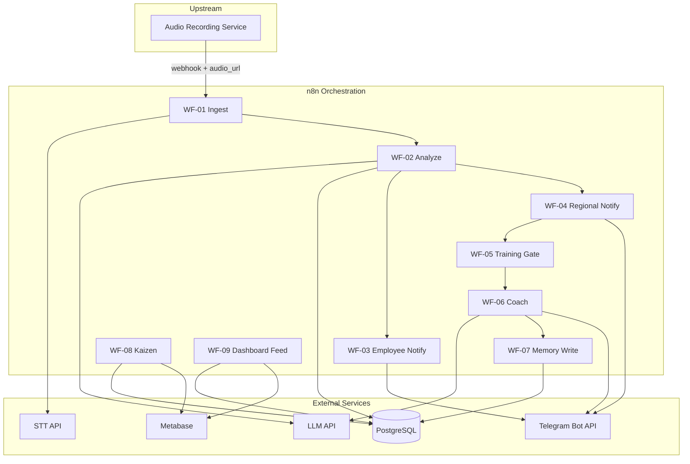

# Sales Flow Intelligence

**Post-recording intelligence layer** для розничных продаж: от транскрипции диалога до управленческой аналитики, AI-тренировки и накопления опыта сотрудников.

Запись аудио на точке продаж выполняется upstream-системой и **не входит в scope** данного модуля. Здесь — оркестрация анализа, уведомлений, human-in-the-loop тренировки и отчётности.

---

## Возможности

| Область | Описание |
|---------|----------|
| **Ingest & STT** | Приём события о диалоге, транскрипция, сохранение в PostgreSQL |
| **AI Sales Analyzer** | Structured output: KPI, ошибки, сигналы клиента, рекомендации |
| **Уведомления** | Краткий разбор сотруднику и управленческое предложение регионалу (Telegram) |
| **Training Gate** | Подтверждение тренировки регионалом перед запуском наставника |
| **AI Coach** | Диалог в Telegram: разбор ошибки, ролевая отработка, фиксация результата |
| **Employee Memory** | Структурированная память по повторяющимся ошибкам (`employee_id` + `error_code`) |
| **Kaizen** | Периодические отчёты по частоте ошибок и повторным паттернам |
| **Dashboard** | Read-only витрина метрик поверх PostgreSQL (Metabase) |

---

## Бизнес-поток

| # | Этап | Workflow |
|---|------|----------|
| 1 | Транскрипция и сохранение диалога | WF-01 Ingest |
| 2 | AI-анализ продажи | WF-02 Analyze |
| 3 | Уведомление сотруднику | WF-03 Notify Employee |
| 4 | Предложение тренировки регионалу | WF-04 Notify Regional |
| 5 | Подтверждение тренировки | WF-05 Training Gate |
| 6 | AI-наставник в Telegram | WF-06 Coach |
| 7 | Запись результата в память | WF-07 Memory Write |
| 8 | Kaizen-отчёты (cron) | WF-08 Kaizen |
| 9 | Обновление данных дашборда | WF-09 Dashboard Feed |

---

## Архитектура



### Принципы

- **Event-driven** — связь между этапами через PostgreSQL и internal webhooks (`dialog_id`, `session_id`).
- **Idempotency** — повторное событие не создаёт дубль анализа.
- **Single responsibility** — один workflow, одна зона ответственности.
- **Human-in-the-loop** — тренировка запускается только после подтверждения регионалом.
- **Structured AI output** — Analyzer и Coach работают с JSON-схемами, не с произвольным текстом.
- **Observability** — статусы диалога, dead letters, retry на каждом критичном шаге.

### Разделение слоёв

| Слой | Ответственность |
|------|-----------------|
| Ingestion | Валидация, STT, запись транскрипта |
| Analysis | LLM-анализ, KPI и ошибки в `analysis_results` |
| Notification | Форматирование и доставка сообщений |
| Training Gate | Ожидание решения регионала, создание `training_session` |
| Coach | Stateful диалог, outcome сессии |
| Memory & Kaizen | Агрегация ошибок, отчёты, эскалация повторов |
| Dashboard | Read-only представление данных |

---

## Стек

| Компонент | Рекомендация |
|-----------|--------------|
| Оркестрация | n8n (self-hosted) |
| База данных | PostgreSQL (JSONB, views, structured memory) |
| STT | OpenAI Whisper / Yandex SpeechKit |
| LLM | GPT-4o / Claude (structured output + coach) |
| Telegram | Bot API (inline-кнопки, диалог наставника) |
| Дашборд | Metabase |
| LLM (dev) | Ollama — опционально для локальной разработки |

---

## Структура репозитория

```
sales_flow_test/
├── infra/                  # Docker Compose, PostgreSQL init, Makefile
│   ├── docker-compose.yml
│   ├── postgres/init/      # Схема БД и seed
│   └── .env.example
├── scripts/
│   ├── demo.sh             # Локальная оркестрация webhook-цепочки
│   ├── setup-n8n.sh        # Импорт workflows + credentials
│   └── sanitize-workflows.py  # Очистка экспорта n8n перед коммитом
└── workflows/export/       # WF-01…WF-09 (без секретов, в git)
```

**Workflows в git** — полный набор пилота (WF-01…WF-09), экспортированный из n8n и очищенный от токенов и PII. Импорт: `make setup-n8n`.

---

## Быстрый старт

**Требования:** Docker, Docker Compose, `curl`, Python 3, **Telegram-бот** (свой token).

```bash
git clone https://github.com/Paladdy/sales_flow_test.git
cd sales_flow_test/infra
cp .env.example .env
# Заполните TELEGRAM_BOT_TOKEN и chat_id (см. ниже)
make up                       # postgres + n8n + import workflows
make demo-auto                # полный прогон WF-01→07 через curl
```

Ожидаемый результат `demo-auto`:
- диалог `770e8400-…` проходит ingest → analyze → notify → coach → memory;
- `dialogs.status = coaching_done`;
- запись в `employee_memory` для `emp_042`.

Проверка:

```bash
make shell-db
# SELECT dialog_id, status FROM dialogs;
# SELECT * FROM employee_memory;
```

### Сервисы после `make up`

| Сервис | URL |
|--------|-----|
| n8n | http://localhost:5678 (порт — `N8N_PORT` в `infra/.env`) |
| PostgreSQL | `localhost:5432`, БД `sales_flow` |
| Metabase (optional) | `make dashboard` → http://localhost:3000 |

Схема БД применяется автоматически из `infra/postgres/init/`.

> **n8n 2.x:** в `docker-compose.yml` задано `N8N_BLOCK_ENV_ACCESS_IN_NODE=false` — иначе
> HTTP-ноды не смогут читать `$env.TELEGRAM_BOT_TOKEN`.

### Режимы demo

| Режим | Команда | Telegram |
|-------|---------|----------|
| **Auto** | `make demo-auto` | Сообщения уходят в чаты из seed; кнопки эмулируются curl |
| **Manual** | `make demo-manual` | Нужен публичный webhook (ngrok) — кнопки и coach в живом чате |

---

## Настройка Telegram

> **Токены в репозиторий не попадают.** Каждый разработчик подключает **своего** бота.

### 1. Создайте бота

1. Откройте [@BotFather](https://t.me/BotFather) → `/newbot` → скопируйте **token**.
2. Узнайте свой `chat_id` (например, через [@userinfobot](https://t.me/userinfobot)).

### 2. Заполните `infra/.env`

```bash
TELEGRAM_BOT_TOKEN=123456:ABC...          # ваш token
N8N_TG_WEBHOOK_ID=                        # n8n → WF-06 Coach → Telegram Trigger → Webhook ID
N8N_TG_WEBHOOK_SECRET=                    # произвольная строка ≥16 символов
SEED_EMPLOYEE_TELEGRAM_CHAT_ID=123456789  # chat_id сотрудника (emp_042)
SEED_REGIONAL_TELEGRAM_CHAT_ID=123456789  # chat_id регионала (reg_01)
```

### 3. Публичный HTTPS URL (для manual demo)

Telegram не шлёт webhook на `localhost`. Поднимите tunnel:

```bash
ngrok http 5678   # или ваш N8N_PORT
# WEBHOOK_URL=https://YOUR-SUBDOMAIN.ngrok-free.dev/
```

Обновите `WEBHOOK_URL` в `infra/.env` и пересоздайте n8n:

```bash
cd infra
docker compose up -d --force-recreate n8n
make setup-n8n
../scripts/demo.sh ensure-telegram
```

### 4. Manual demo

```bash
make demo-manual
# → в Telegram нажать «Подтвердить тренировку»
# → ответить боту 2–4 раза
./scripts/demo.sh wf07
```

---

## Обновление workflows из n8n

```bash
# 1. Экспорт из n8n UI → workflows/export-real/*.json (локально, не коммитить)
# 2. Очистка и переименование:
python3 scripts/sanitize-workflows.py
# 3. Импорт в локальный n8n:
cd infra && make setup-n8n
```

---

## Операции

```bash
make ps          # статус контейнеров
make logs        # логи
make shell-db    # psql в sales_flow
make setup-n8n   # переимпорт workflows
make demo-auto   # автоматический прогон
make demo-manual # manual (нужен ngrok + webhook)
make restart     # перезапуск + optional telegram webhook
make down        # остановка
```

---

## Модель данных (ключевые сущности)

| Таблица | Назначение |
|---------|------------|
| `dialogs` | Диалог, статус pipeline (`ingested` → `coaching_done`) |
| `analysis_results` | JSON-результат Analyzer |
| `pending_training_actions` | Токен inline-кнопки для регионала |
| `training_sessions` | Состояние сессии Coach (`intro`, `roleplay`, `done`) |
| `employee_memory` | Память по ошибкам: `occurrence_count`, `coaching_notes` |
| `kaizen_reports` | Сгенерированные отчёты |
| `dead_letters` | Ошибки pipeline для разбора |

---

## Безопасность и compliance

- Секреты — только в `.env` и n8n Credentials; `.env` не коммитится.
- Обработка аудио и персональных данных требует согласования с юристами (152-ФЗ, уведомление о записи, retention).
- Рекомендуется политика хранения для транскриптов, памяти сотрудников и логов.
- Internal webhooks — защита через secret token и Basic Auth на n8n UI.

---

## Эволюция в production

| Слой | Текущая реализация | Production |
|------|-------------------|------------|
| Оркестрация | n8n | FastAPI + Celery/ARQ |
| Контракты БД | PostgreSQL, JSON schema | Без изменений |
| LLM / Telegram | n8n nodes | Python-сервисы |
| RAG (скрипт продаж, KB) | Roadmap | pgvector + корпоративные документы |

n8n используется как **integration layer на этапе внедрения**; целевая промышленная архитектура — Python-сервисы поверх той же схемы данных.

---

## Лицензия и статус

Проект находится в стадии **пилотной интеграции**. Production rollout требует hardening STT, diarization, корпоративного rubric и юридического согласования.
