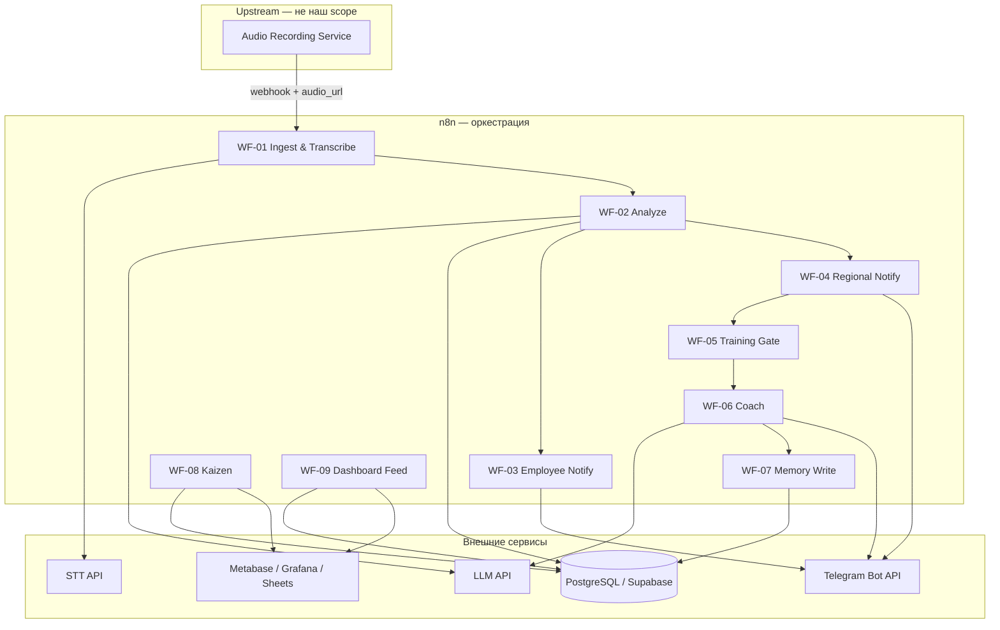

# Sales Flow Intelligence — ТД ТМК

> **Post-recording intelligence layer** для розничных продаж.  
> Запись диалога (камера / микрофон) — **вне scope**. Наша система начинается с **транскрипции аудио** и заканчивается **дашбордом, Kaizen и AI-тренировкой**.

---

## Для кого этот репозиторий

Документация для **senior AI-интегратора**: архитектура, контракты данных, безопасность, отказоустойчивость и **пошаговая сборка в n8n**.

**Код здесь не пишется.** Реализация — workflow-ноды в n8n, которые вы собираете по этой спецификации.

---

## Бизнес-поток (10 шагов)

| # | Шаг | Ответственность | Где в n8n |
|---|-----|-----------------|-----------|
| 0 | Запись диалога (аудио) | Upstream / камера | — |
| 1 | Транскрипция | **Мы** | WF-01 Ingest |
| 2 | AI Sales Analyzer | **Мы** | WF-02 Analyze |
| 3 | JSON: KPI, ошибки, сигналы | **Мы** | WF-02 Analyze |
| 4 | Короткий разбор сотруднику | **Мы** | WF-03 Notify Employee |
| 5 | Управленческое предложение регионалу | **Мы** | WF-04 Notify Regional |
| 6 | «Подтвердить тренировку» | **Мы** | WF-05 Training Gate |
| 7 | AI-наставник в Telegram | **Мы** | WF-06 Coach |
| 8 | Результат → AI Memory | **Мы** | WF-06 + WF-07 Memory |
| 9 | Повторы → Daily / Weekly Kaizen | **Мы** | WF-08 Kaizen (cron) |
| 10 | Дашборд | **Мы** | WF-09 Dashboard feed |

---

## Архитектурный принцип



### Разделение слоёв

| Слой | Что делает | Чего не делает |
|------|------------|----------------|
| **Ingestion** | Принимает событие, валидирует, ставит в очередь, вызывает STT | Не анализирует продажу |
| **Analysis** | LLM + JSON Schema, сохраняет `analysis_result` | Не шлёт Telegram |
| **Notification** | Форматирует короткие сообщения, отправляет | Не принимает решение о тренировке |
| **Training Gate** | Ждёт подтверждения регионала, создаёт `training_session` | Не ведёт диалог наставника |
| **Coach** | Stateful диалог в Telegram, фиксирует outcome | Не пересчитывает KPI |
| **Memory & Kaizen** | Агрегация, частота ошибок, отчёты | Не транскрибирует |
| **Dashboard** | Read-only витрина из БД | Не пишет бизнес-логику |

**Правило:** один workflow — одна ответственность. Связь только через **БД + webhook + стабильные JSON-контракты**.

---

## Структура документации

| Файл | Содержание |
|------|------------|
| [docs/ARCHITECTURE.md](docs/ARCHITECTURE.md) | Слои, статусы, idempotency, обработка потерь |
| [docs/N8N_WORKFLOWS.md](docs/N8N_WORKFLOWS.md) | **Главный гайд:** какие ноды, в каком порядке, что настраивать |
| [docs/CONTRACTS.md](docs/CONTRACTS.md) | JSON-схемы, поля БД, webhook payloads |
| [docs/PROMPTS.md](docs/PROMPTS.md) | Промпты для Analyzer и Coach (без скрипта ТМК + TODO) |
| [docs/RAG_ROADMAP.md](docs/RAG_ROADMAP.md) | **TODO:** RAG после появления KB ТМК (не MVP, но плюс к архитектуре) |
| [docs/PRODUCTION_EVOLUTION.md](docs/PRODUCTION_EVOLUTION.md) | n8n pilot → **Python** production (не Java) |
| [docs/SECURITY.md](docs/SECURITY.md) | Секреты, PII, retention, audit |
| [infra/README.md](infra/README.md) | Docker, PostgreSQL, n8n — локальный стенд |
| [docs/PILOT_PROGRESS.md](docs/PILOT_PROGRESS.md) | **Статус пилота:** что собрано в n8n, learnings |
| [docs/N8N_LLM_OLLAMA.md](docs/N8N_LLM_OLLAMA.md) | WF-02 LLM через Ollama + HTTP patterns |

---

## Статус пилота (2026-05-24)

| WF | Статус |
|----|--------|
| WF-01 … WF-09 | ✅ **пилот завершён** (9/9) |

Детали: [docs/PILOT_PROGRESS.md](docs/PILOT_PROGRESS.md)

Подробности, тестовый `dialog_id`, ngrok, типичные ошибки n8n: [docs/PILOT_PROGRESS.md](docs/PILOT_PROGRESS.md).

---

## Локальный стенд (Docker)

```bash
cd infra
cp .env.example .env   # смените пароли
make up
```

- **n8n:** http://localhost:5678  
- **PostgreSQL:** `localhost:5432`, database `sales_flow`  
- Схема БД поднимается автоматически из `infra/postgres/init/`

Подробно: [infra/README.md](infra/README.md)

---

## Стек (рекомендация для теста)

| Компонент | Рекомендация | Почему |
|-----------|--------------|--------|
| Оркестрация | **n8n** (self-hosted или cloud) | Явное ТЗ: сборка нодами |
| STT | OpenAI Whisper API / Yandex SpeechKit | RU retail, шум — TODO tuning |
| LLM | GPT-4o / Claude 3.5 | Structured output + диалог coach (**обязательно**) |
| RAG | — | **Не в MVP** → см. [RAG_ROADMAP.md](docs/RAG_ROADMAP.md) |
| БД | **PostgreSQL** (Supabase) | Транзакции, JSONB, structured AI memory |
| Очередь / retry | n8n Error Workflow + таблица `job_queue` | Контроль потерь |
| Telegram | Bot API через n8n Telegram node | Inline-кнопки для регионала |
| Дашборд | Metabase поверх PostgreSQL | Быстро, без кода |

---

## Ключевые решения (почему нас выделят)

1. **Чёткая граница scope** — не смешиваем камеру и AI-анализ.
2. **Event-driven + idempotency** — повтор webhook не создаёт дубль анализа.
3. **Structured output** — Analyzer возвращает JSON по схеме, не «простыню текста».
4. **Human-in-the-loop** — тренировка только после кнопки регионала.
5. **Observability** — каждый шаг пишет `status`, `error_code`, `retry_count`.
6. **Graceful degradation** — STT упал → job в retry; LLM упал → dead letter + алерт.
7. **TODO явно** — diarization, скрипт ТМК, RAG, legal — не притворяемся, что сделано.
8. **LLM без RAG в MVP** — осознанно: KB ТМК нет; roadmap RAG задокументирован как production plus.
9. **n8n — pilot, Python — production** — industrial path на FastAPI/workers, не Java; см. [PRODUCTION_EVOLUTION.md](docs/PRODUCTION_EVOLUTION.md).

---

## n8n сейчас, Python в production

| | Сейчас (тест / пилот) | Production (наша команда) |
|---|------------------------|---------------------------|
| Оркестрация | **n8n** | **FastAPI + Celery/ARQ** |
| БД и контракты | PostgreSQL, JSON schema | **Те же** — миграция без перепроектирования |
| Язык | low-code | **Python** (LLM, Telegram, RAG) |

Критика «n8n в проде — проблема» **справедлива для scale**. Мы это фиксируем и показываем **план эволюции на Python**, не на Java/Spring.

Подробно: [docs/PRODUCTION_EVOLUTION.md](docs/PRODUCTION_EVOLUTION.md)

---

## LLM и RAG — решение для тестового

| | MVP (тест) | Production plus |
|---|------------|-----------------|
| **LLM** | ✅ Analyzer + Coach | То же + repair prompts |
| **SQL memory** | ✅ `employee_memory` | + retention policy |
| **RAG** | ❌ Не делаем | ✅ Скрипт ТМК, каталог, best practices → pgvector |

**LLM — ядро.** **RAG — следующий этап**, когда появятся корпоративные документы. Подробно: [docs/RAG_ROADMAP.md](docs/RAG_ROADMAP.md).

---

## Быстрый старт (ваши действия в n8n)

1. Прочитать [docs/N8N_WORKFLOWS.md](docs/N8N_WORKFLOWS.md) — там порядок сборки WF-01 → WF-09.
2. Поднять PostgreSQL и создать таблицы по [docs/CONTRACTS.md](docs/CONTRACTS.md).
3. Создать Telegram-бота, положить token в n8n Credentials.
4. Собрать WF-01 с **тестовым** audio URL (симуляция upstream).
5. Подключить WF-02 с промптом из [docs/PROMPTS.md](docs/PROMPTS.md).
6. Довести цепочку до Telegram и кнопки «Подтвердить тренировку».
7. Cron WF-08 + read-only дашборд.

---

## Scope пилота

- **1 магазин** (`store_001`)
- Несколько сотрудников (`employee_id`)
- Синтетические / тестовые аудио на демо
- Generic rubric продаж (скрипт ТМК — TODO)

---

## Legal disclaimer (для README сдачи)

> Аудиозапись выполняется upstream-системой магазина. Данный модуль обрабатывает уже полученные записи. Production rollout требует согласования с юристами (152-ФЗ, уведомление о записи, retention). Анонимизация имён не отменяет требований к обработке биометрии/голоса — см. [docs/SECURITY.md](docs/SECURITY.md).

---

## Чеклист сдачи тестового

- [x] WF-01 принимает webhook, сохраняет `transcript` (пилот: stub / test ingest)
- [x] WF-02 возвращает JSON в `analysis_results` (Ollama `llama3.2:1b`, MVP quality)
- [x] Сотрудник получает короткий разбор в Telegram (WF-03, HTTP → Telegram API)
- [x] Регионал получает предложение + inline-кнопки (WF-04)
- [x] Callback «Подтвердить / Не сейчас» → `training_approved` / `training_skipped` (WF-05 + ngrok)
- [x] Coach запускается только после confirm (WF-06)
- [x] Memory обновляется после тренировки (WF-07)
- [x] Kaizen cron агрегирует top errors за 7 дней (WF-08)
- [x] Дашборд показывает: диалоги, ошибки, тренировки (WF-09 / `v_dashboard_summary`)
- [ ] Error workflow + retry задокументированы
- [ ] TODO: diarization, TMK script, production STT, RAG (roadmap описан)
- [ ] TODO: Python production path (см. PRODUCTION_EVOLUTION.md)

---

*Документ подготовлен как спецификация интеграции. Реализация — n8n workflows по приложенным гайдам.*
